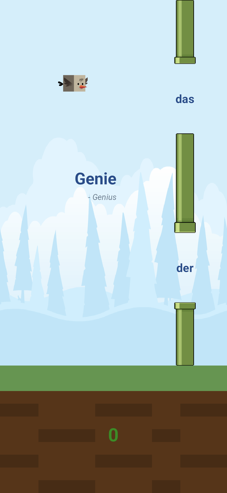

# Artikel Vogel

  

## About
Artikel Vogel is a simple web and mobile game designed to help players memorize German noun genders (der, die, das) using the classic Flappy Bird mechanic.

## Tech Stack
- **Framework**: Flutter
- **Game Engine**: Flame
- **Web Host**: GitHub Pages

## How to Play (Web)
1. Open the [Web App](https://studio10200.dev/artikel-vogel/)
2. Tap to flap.
3. Fly through the gap with the correct article (der / die / das) of the German noun shown.

## Installation (Android)
1. Download the latest APK from the [Releases](https://github.com/3llips3s/artikel-vogel/releases) page 
2. Open the APK on your Android device.
3. If prompted, allow "Installation from Unknown Sources".
4. Install and enjoy :)

## License
MIT License. See [LICENSE](LICENSE) for details.
